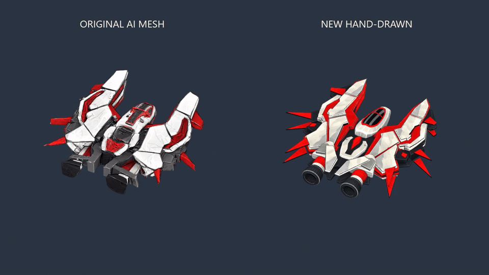

# Crimson

Open `Crimson.blend` for the approved editable ship and first hand-painted texture
pass. The 39 mesh parts stay separate, with 33 live Mirror modifiers centered on
the ship. The original design references and the color atlas
are packed into the file; external copies are included for editing.

`Crimson.fbx` is a textured interchange export with the modifiers evaluated.
It contains only the ship meshes, with embedded color texture, UVs and normals.
The Blender source uses X across the wings, +Y toward the nose and +Z up; the FBX
uses -Z forward and Y up. Gameplay prefabs and ship configuration are unchanged.

## Texture editing

The `CrimsonPaintUV` map uses `textures/Crimson_BaseColor.png`, a 4096×4096 atlas.
Mirrored parts share their paint. Select the atlas in Blender's Texture Paint
workspace to edit it. Save the external image and repack it when saving the blend.
The saved solid viewport uses Texture color and Flat lighting to show the painted
highlights and shadows. The material also references the atlas for base color.

UV islands are scaled against world-space surface area before packing. Preserve
object transforms and Mirror modifiers by doing that calculation on temporary
copies, then transfer the UV coordinates back. The atlas uses a 0.008 packing
margin and 12 pixels of bake dilation. Rebake the paint into the new layout;
resizing the old painted islands cannot recover their missing detail.

Run `blender -b --python-exit-code 1 --python check_uv_density.py` from this folder
to check evaluated surface density. `uv-density.json` records the current values;
the check rejects a maximum/minimum ratio above 1.25.

Unity uses copies of the FBX and atlas plus a saved combined mesh in
`src/Asteroids3D/Assets/Visuals/Ships/Crimson/`. Update that mesh's UV coordinates
alongside the source files; replacing the FBX alone does not update it. Preserve
its separate paint and contour vertex ranges and their authored normals.

`reference/approved-texture-concept.png` is the approved hand-drawn direction:
silver armor, red insets, charcoal structure, dark outlines and broad painted
light and shadow shapes. `textures/painted-brush-source.png` supplies the imagegen
brush variation; its exact prompt is alongside it. Generated concepts guide the
paint treatment; the Blender geometry is authoritative.

## Review evidence

The following turntable records the original approved texture pass, before the
UV density correction. The stills above and below use the current atlas.

- [Full-resolution turntable video](previews/old-vs-new-turntable.mp4), original AI
  mesh on the left and rebuilt ship on the right, matched by nose-to-tail length.
- [Top](previews/textured-top.png), [side](previews/textured-side.png),
  [front](previews/textured-front.png) and [game-scale](previews/textured-game-scale.png)
  texture checks.
- `orthographic/` contains untextured geometry captures.
- `asset-validation.json` records mesh, texture and FBX round-trip checks.

The approved source retains 14 non-manifold edges across `Cube` and `Structural
center web`; no faces have zero area. These authored parts are preserved in the
render mesh rather than repaired as part of the asset handoff.

These are Blender previews of the asset, not an in-engine rendering match.
