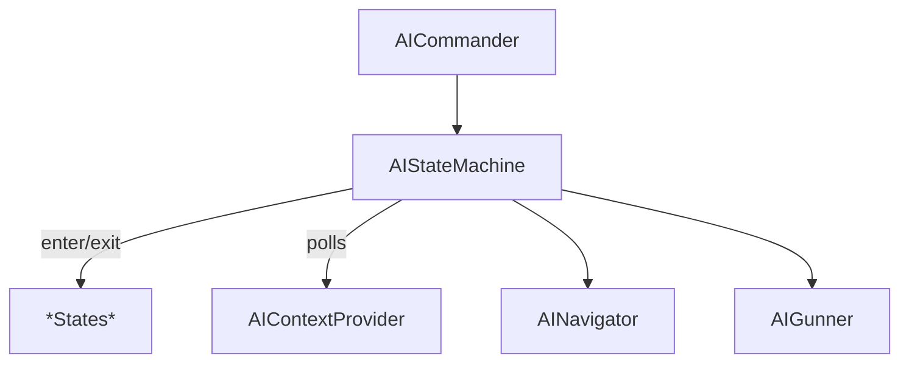

# AI State System Refactor Plan

**Author:** _<your-name-here>_

**Date:** _<yyyy-mm-dd>_

---

## 1&nbsp;— Objectives

* Remove all dependencies on **Unity.Behavior** Behaviour Trees (BT) and associated editor tooling.
* Replace with a lightweight, code-driven **Finite State & Utility System** that is easier to debug, unit-test and iterate on.
* Preserve (or improve) existing pilot, navigation and combat behaviour while reducing per-frame GC pressure.
* Provide a migration path that allows old BT-based agents to run during the transition period.

---

## 2 — Current Architecture (BT-based)

```mermaid
flowchart TD
    AICommander -->|queries| AIContextProvider
    AICommander --> AINavigator
    AICommander --> AIGunner
    AIContextProvider --> BehaviorGraphAgent
    BehaviorGraphAgent -->|executes| BT[Behavior&nbsp;Tree]
    BT -->|actions/conditions| *Nodes (\~20 C# scripts)*
```

Key points:

* **BehaviorGraphAgent** owns the runtime tree and blackboard.
* ~15 custom *Action*/*Condition* nodes orchestrate navigation, combat and utility evaluation.
* High reflection overhead & noisy logs when nodes are rebuilt at runtime.

---

## 3 — Proposed Architecture (State + Utility)



### Components

| Component | Responsibility |
|-----------|----------------|
| **AIContextProvider** | *Unchanged.* Continues to gather world & self metrics each frame. |
| **AIStateMachine (NEW)** | Chooses highest-utility state (by querying each state's built-in `ComputeUtility`), handles hysteresis, and dispatches `Enter / Tick / Exit`. **No global enum or external evaluator is required**; the machine stores concrete `AIState` instances. |
| **State classes (NEW)** | One C# class per logical state (`IdleState`, `PatrolState`, `EvadeState`, `AttackState`, …). Constructed with references to **`AINavigator`** & **`AIGunner`** (dependency-injection style). Each state implements `float ComputeUtility(in AIContext ctx)` plus its own behaviour. |
| **AICommander** | Hosts and updates the `AIStateMachine`; BT components removed. |

Benefits:

* **Deterministic** per-frame update order.
* **Zero reflection** once compiled.
* **Unit-testable** state logic without scene dependencies.
* **Easier debugging** – attach logs & gizmos per state.

---

## 4 — Implementation Roadmap

### Phase 0 — Preparation

1. Audit all scripts under `Assets/Scripts/AI/BT` – categorise into *keep* (e.g., Utility curves) vs *remove* (BT nodes).
2. Freeze feature work on BT to avoid merge conflicts.
3. Write baseline play-tests to capture current AI performance.

### Phase 1 — Infrastructure

1. **Create** `AIState` abstract base:
   ```csharp
   public abstract class AIState {
       protected readonly AINavigator Navigator;
       protected readonly AIGunner   Gunner;

       protected AIState(AINavigator nav, AIGunner gunner) {
           Navigator = nav;
           Gunner    = gunner;
       }

       // Called when the state becomes active
       public virtual void Enter(in AIContext ctx) {}

       // Called every FixedUpdate while active
       public virtual void Tick(in AIContext ctx, float dt) {}

       // Called before transitioning away
       public virtual void Exit() {}

       // Returns utility score [0,1] given current context.
       public abstract float ComputeUtility(in AIContext ctx);

       #region Convenience Helpers
       // Derived states can call these thin wrappers – keeps usages consistent.
       protected void MoveTo(Vector3 worldPos, bool avoid=true) => Navigator.SetNavigationPoint(worldPos, avoid);
       protected bool FirePrimary()  => Gunner?.TryFireLaser()  ?? false; // example placeholder APIs
       protected bool FireMissile()  => Gunner?.TryFireMissile() ?? false;
       #endregion
   }
   ```
2. **Implement** `AIStateMachine` class:
   * Holds a `List<AIState>` (concrete instances supplied at construction, each pre-wired with `AINavigator` & `AIGunner`).
   * Each physics tick:
       1. Retrieve latest `AIContext` from provider.
       2. Iterate through states, calling `ComputeUtility(ctx)`.
       3. Select highest-utility state (with hysteresis / min-time-in-state).
   * Manages current state lifecycle (`Enter/Exit/Tick`).
   * **No enum or external evaluator needed.**
3. Extend **AICommander**:
   * Remove `BehaviorGraphAgent` requirement.
   * Instantiate & update `AIStateMachine` from `FixedUpdate()`.

### Phase 2 — State Migration

| Legacy BT Node(s) | New AIState Class | Utility Strategy |
|-------------------|-------------------|------------------|
| `Idle` | `IdleState` | High base utility if shields/health are low & no nearby threats. |
| `PatrolRandomAction` | `PatrolState` | Utility = 1 when no valid enemy detected, else 0. |
| `EvadeAction` | `EvadeState` | Utility rises steeply as health/shield drop or missile/threat count increases. |
| `SeekTargetAction` + firing nodes | `AttackState` | Utility grows with high own health, low enemy health, LOS, ammo, etc. |

Implementation steps per state:
1. Port action logic into state `Enter/Tick/Exit`, using injected `Navigator` and `Gunner` helpers instead of calling methods on `AICommander`.
2. Implement `ComputeUtility(in AIContext ctx)` by moving formulas from `AIUtilityEvaluator`. Remove those functions afterwards.
3. Add unit tests to ensure utility matches previous evaluator results.

### Phase 3 — Removal of BT

1. Delete `BehaviorGraphAgent` components from prefabs.
2. Remove `.asmdef` reference to `Unity.Behavior`.
3. Physically delete `Assets/Scripts/AI/BT` **after** confirming compilation succeeds.
4. Update CI build pipeline.

### Phase 4 — Polish & Optimisation

* Profile GC allocations – ensure no new spikes from state updates.
* Add **in-editor gizmos** displaying current state & utility scores.
* Balance utility curve weights for desired behaviour.

---

## 5 — Decommissioning `AIUtilityEvaluator` & Enum

* Once all states provide their own utilities, delete `AIUtilityEvaluator` and `AIShipBehaviorStates` enum.
* Refactor any editor or debug UI to query `AIStateMachine.CurrentState.GetType().Name` instead of enum.

---

## 6 — Backwards Compatibility Strategy

* Keep BT components in a separate package branch for one sprint.
* Provide dummy `BehaviorGraphAgent` that logs error if accidentally used.
* Update documentation and tutorial scenes to new system.

---

## 8 — Timeline (2 sprints)

| Week | Deliverables |
|------|--------------|
| 1.1 | Phase 0 audit & baseline tests |
| 1.2 | Phase 1 infrastructure merged to `dev` |
| 2.1 | Phase 2 states implemented, play-test feedback |
| 2.2 | Phase 3 BT removal + docs |

---

## 9 — Risks & Mitigations

| Risk | Likelihood | Impact | Mitigation |
|------|-----------|--------|------------|
| Behaviour regression | Med | High | Keep feature parity tests; incremental rollout. |
| Unknown BT dependencies | Low | Med | Static code search before deletion. |
| Team unfamiliarity | Med | Med | Pair-programming sessions; code reviews. |

---

## 10 — References

* [Game AI Pro, Ch.4 – Finite State Machines](https://gameaipro.com)
* Unity DOTS Sample – *State Machine* implementation.

---

> **Next Step:** Approve this plan, assign task owners and create corresponding Jira tickets. 