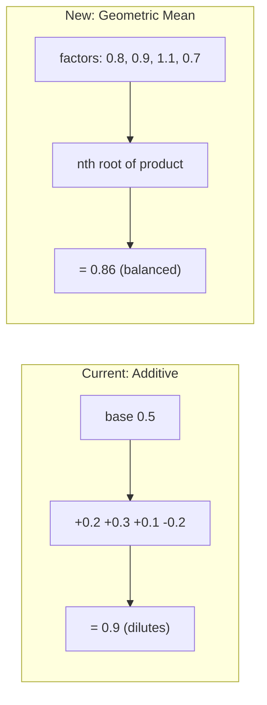

# Geometric Mean Utility Refactor

## Problem Statement

The current additive scoring suffers from dilution as modifiers stack, and the `AddFear`/`AddDesire` naming is semantically confusing (e.g., "fear" of enemy being weak).

## Solution

Replace with **geometric mean scoring** where each factor answers: "What percentage of my desire for this action remains?"



## API Changes

### Before

```csharp
return UtilityBuilder.AttackBase(ctx, tuning)
    .AddFear("finishOff", enemyHealth, 0.3f)  // confusing name
    .AddIf(hasLOS, "los", 0.1f)               // additive bonus
    .Build();
```

### After

```csharp
return new UtilityBuilder()
    .Factor("selfHealth", ctx.HealthPct, tuning.attackHealthFactor)        // 0.2 to 1.0
    .Factor("enemyWeak", enemyHealth, tuning.attackEnemyWeakFactor, invert: true)  // 1.3 at low, 1.0 at high
    .Factor("hasLOS", ctx.LineOfSightToEnemy ? 1f : tuning.attackNoLOSFactor)
    .Factor("range", RangeScore(dist), tuning.attackRangeFactor)
    .Build();  // returns geometric mean
```

## Implementation Steps

### 1. Rewrite UtilityBuilder

**File:** [Scripts/AI/Utility/UtilityBuilder.cs](Scripts/AI/Utility/UtilityBuilder.cs)

New core structure:

```csharp
public class UtilityBuilder
{
    private float product = 1f;
    private int count = 0;
    
    // Core method: multiply a factor into the score
    public UtilityBuilder Factor(string name, float value)
    {
        product *= Mathf.Clamp(value, 0.01f, 2f);
        count++;
        Track(name, value);
        return this;
    }
    
    // Curve helper: maps input [0,1] to factor range using smoothstep
    public UtilityBuilder Factor(string name, float input, FactorRange range)
    {
        var t = Mathf.Clamp01(input);
        t = t * t * (3f - 2f * t);  // smoothstep
        var value = Mathf.Lerp(range.AtLow, range.AtHigh, t);
        return Factor(name, value);
    }
    
    // Conditional factor
    public UtilityBuilder FactorIf(bool condition, string name, float valueIfTrue, float valueIfFalse = 1f)
    {
        return Factor(name, condition ? valueIfTrue : valueIfFalse);
    }
    
    // Geometric mean output
    public float Build()
    {
        if (count == 0) return 0f;
        return Mathf.Clamp01(Mathf.Pow(product, 1f / count));
    }
}
```

Remove: `AttackBase`, `EvadeBase` presets (each state defines its own factors explicitly).

### 2. Add FactorRange struct

**File:** [Scripts/AI/Utility/UtilityBuilder.cs](Scripts/AI/Utility/UtilityBuilder.cs)

```csharp
[System.Serializable]
public struct FactorRange
{
    public float AtLow;   // factor when input = 0
    public float AtHigh;  // factor when input = 1
    
    public FactorRange(float atLow, float atHigh) { AtLow = atLow; AtHigh = atHigh; }
    
    public FactorRange Inverted => new FactorRange(AtHigh, AtLow);
}
```

### 3. Update UtilityTuning

**File:** [Scripts/AI/Utility/UtilityTuning.cs](Scripts/AI/Utility/UtilityTuning.cs)

Replace additive bonus params with factor ranges:

| Old Parameter | New Parameter | Meaning |

|---------------|---------------|---------|

| `attackUtilityHealthBonus = 0.2f` | `attackHealthFactor = (0.3, 1.0)` | Low health = 30%, full = 100% |

| `attackUtilityEnemyWeakBonus = 0.3f` | `attackEnemyWeakFactor = (1.3, 1.0)` | Weak enemy = 130%, healthy = 100% |

| `attackUtilityLOSBonus = 0.1f` | `attackNoLOSFactor = 0.4f` | No LOS = 40% of score |

### 4. Refactor State ComputeUtility Methods

**Files to update:**

- [Scripts/AI/States/Attack.cs](Scripts/AI/States/Attack.cs)
- [Scripts/AI/States/Evade.cs](Scripts/AI/States/Evade.cs)
- [Scripts/AI/States/JinkEvade.cs](Scripts/AI/States/JinkEvade.cs)
- [Scripts/AI/States/Orbit.cs](Scripts/AI/States/Orbit.cs)
- [Scripts/AI/States/Kite.cs](Scripts/AI/States/Kite.cs)

Example Attack.cs:

```csharp
public override float ComputeUtility(Info ctx)
{
    if (!ctx.Enemy) return 0f;

    var dist = ctx.VectorToEnemy.magnitude;
    var enemyHealth = (ctx.EnemyHealthPct + ctx.EnemyShieldPct) / 2f;

    return new UtilityBuilder()
        .Factor("selfHealth", ctx.HealthPct, tuning.attackHealthFactor)
        .Factor("selfShield", ctx.ShieldPct, tuning.attackShieldFactor)
        .Factor("enemyWeak", enemyHealth, tuning.attackEnemyWeakFactor.Inverted)
        .FactorIf(ctx.LineOfSightToEnemy, "hasLOS", 1f, tuning.attackNoLOSFactor)
        .Factor("range", ComputeRangeFactor(dist), tuning.attackRangeFactor)
        .Factor("threat", ComputeThreatFactor(ctx), tuning.attackThreatFactor)
        .Build();
}
```

### 5. Clean Up

- Remove `Utility.cs` entirely (now truly unused)
- Update `utility_builder_improvements.md` with new approach

## Tuning Guidelines

When defining factor ranges:

- **1.0** = neutral (no effect)
- **Less than 1.0** = suppresses the action (0.5 = halves desire)
- **Greater than 1.0** = amplifies the action (1.3 = 30% boost)
- **0.01** = floor, effectively vetoes but doesn't zero out geometric mean

## Migration Notes

Existing tuning assets will need new values. Default factor ranges:

| State | Factor | Range (low, high) |

|-------|--------|-------------------|

| Attack | selfHealth | (0.3, 1.0) |

| Attack | enemyWeak | (1.3, 1.0) |

| Attack | hasLOS | false=0.4, true=1.0 |

| Evade | selfHealth | (1.0, 0.3) |

| Evade | missile | false=1.0, true=1.4 |