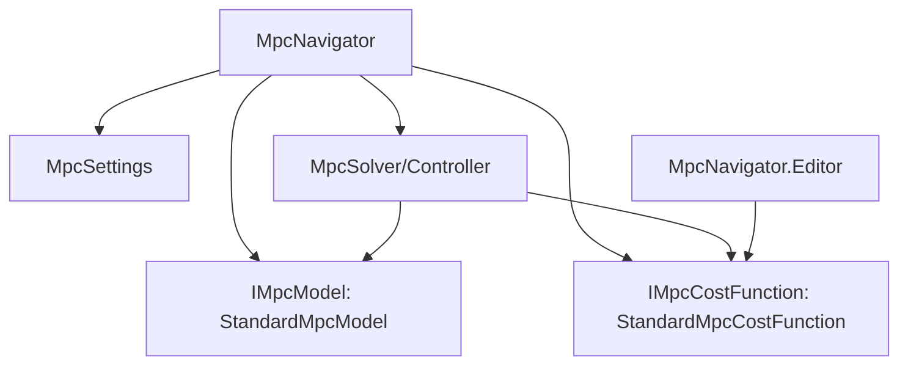

# Refactor MPC for Modularity and Transparency

This plan refactors the MPC system in `Scripts/AI/Steering/MPC/` to follow SOLID principles and project conventions.

## 1. Abstractions and Settings

- Create [`Scripts/AI/Steering/MPC/MpcInterfaces.cs`](Scripts/AI/Steering/MPC/MpcInterfaces.cs) defining:
    - `IMpcModel`: Dynamics integration (`Step` function).
    - `IMpcCostFunction`: Trajectory evaluation logic.
- Create [`Scripts/AI/Steering/MPC/MpcSettings.cs`](Scripts/AI/Steering/MPC/MpcSettings.cs) as a `ScriptableObject` to hold weights, horizon, and sampling parameters.

## 2. Implementation Modules

- Implement [`Scripts/AI/Steering/MPC/StandardMpcModel.cs`](Scripts/AI/Steering/MPC/StandardMpcModel.cs):
    - Encapsulates ship physics (thrust, torque, damping, integration).
- Implement [`Scripts/AI/Steering/MPC/StandardMpcCostFunction.cs`](Scripts/AI/Steering/MPC/StandardMpcCostFunction.cs):
    - Calculates weighted costs for position, velocity, heading, effort, and obstacles.
    - Centralizes obstacle cost calculation for both solver and debug visualization.

## 3. Solver and Navigator Refactoring

- Refactor [`Scripts/AI/Steering/MPC/MpcController.cs`](Scripts/AI/Steering/MPC/MpcController.cs):
    - Remove hardcoded physics and costs.
    - Accept `IMpcModel` and `IMpcCostFunction` as parameters in the `Solve` method.
- Refactor [`Scripts/AI/Steering/MPC/MpcNavigator.cs`](Scripts/AI/Steering/MPC/MpcNavigator.cs):
    - Orchestrate the new modules.
    - Use `var`, fix Unity null checks, and follow concise coding standards.
- Harmonize [`Scripts/AI/Steering/MPC/Editor/MpcNavigator.Editor.cs`](Scripts/AI/Steering/MPC/Editor/MpcNavigator.Editor.cs):
    - Use the central `IMpcCostFunction` instance for gizmo rendering to ensure visualization matches AI intent.
