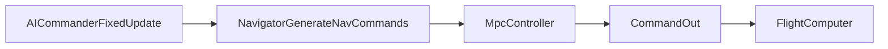

# Shooting MPC (thrust/strafe/yaw) — step-by-step plan

## Data-flow you’ll hook into

- The integration point is `Navigator.GenerateNavCommands()` in [`Assets/Scripts/AI/Navigator.cs`](d:\amind\git\astronomical-home\src\Asteroids3D\Assets\Scripts\AI\Navigator.cs).
- Raw yaw is supported via `Command.YawTorque` in [`Assets/Scripts/Ships/Control/Command.cs`](d:\amind\git\astronomical-home\src\Asteroids3D\Assets\Scripts\Ships\Control\Command.cs).
- Important detail: `FlightComputer` chooses yaw input via `cmd.RotateToTarget ? PD(...) : cmd.YawTorque`, so for MPC yaw you should set **`cmd.RotateToTarget = false`** and write **`cmd.YawTorque`**. (The comment “overrides if non-zero” is misleading in this codepath.) See [`Assets/Scripts/Ships/Movement/FlightComputer.cs`](d:\amind\git\astronomical-home\src\Asteroids3D\Assets\Scripts\Ships\Movement\FlightComputer.cs).

## Implementation tasks (do these in order)

### 1) Add an MPC toggle + minimal config surface

- In [`Assets/Scripts/AI/Navigator.cs`](d:\amind\git\astronomical-home\src\Asteroids3D\Assets\Scripts\AI\Navigator.cs) add:
  - `bool useMpc`
  - MPC tuning fields: `horizonSeconds`, `rolloutDt`, `samples`, `noiseStd`, and a few cost weights (`wPos`, `wVel`, `wYaw`, `wYawRate`, `wEffort`, `wDeltaU`, plus terminal multipliers).
- Keep the existing `PathPlanner + Pilot` path as the fallback for A/B comparisons.

### 2) Create MPC “core” as pure C# (no MonoBehaviour)

Add a new file like [`Assets/Scripts/AI/Steering/MpcController.cs`](d:\amind\git\astronomical-home\src\Asteroids3D\Assets\Scripts\AI\Steering\MpcController.cs) containing:

- `MpcState` (plane position/velocity + yaw + yawRate)
- `MpcControl` (thrust/strafe/yawTorque in [-1,1])
- `MpcConfig` (dt, horizon steps N, limits, weights)
- `Step(state, control) -> nextState` (your simplified dynamics)
- `EvaluateTrajectoryCost(states, controls) -> float`

### 3) Build the simplified dynamics model (start intentionally “wrong but stable”)

Use plane-space from `Kinematics` (`Pos`, `Vel`, `Yaw`, `YawRate`) in [`Assets/Scripts/Ships/Movement/Kinematics.cs`](d:\amind\git\astronomical-home\src\Asteroids3D\Assets\Scripts\Ships\Movement\Kinematics.cs).

- **Units**: pick one internally.
  - Recommended: convert to radians for yaw math inside MPC, convert back to degrees only when you build the `Command`.
- Linear model:
  - Build `fwd/right` from yaw.
  - Map `thrust/strafe` to accelerations using the same values `Navigator` already computes (`SteeringTuning` is accel-like: forward/reverse/strafe per mass).
  - Euler integrate `v` and `p`.
  - Clamp `|v|` to `maxSpeed` (to keep rollouts sane).
- Yaw model (simple 2nd order):
  - `omega += (alphaMax * yawCmd - damping * omega) * dt`
  - clamp `omega` to `maxYawRate` (convert to rad/s)
  - `yaw += omega * dt` and wrap to [-pi, pi)
- Start with constants `alphaMax` and `damping` as *MPC model parameters* (you’ll tune by observing behavior), derived loosely from `ShipSettings.maxYawRate` in [`Assets/Scripts/Ships/ShipSettings.cs`](d:\amind\git\astronomical-home\src\Asteroids3D\Assets\Scripts\Ships\ShipSettings.cs).

### 4) Implement shooting MPC (random sequences) with warm start

- Choose defaults:
  - `rolloutDt = 0.1s`, `horizonSeconds = 1.5s` → `N=15`
  - `samples = 128` (start), `noiseStd = 0.25`
- Store `bestSequence` from last frame; each tick:
  - shift it left by 1 (warm start)
  - sample `samples-1` new sequences by adding Gaussian noise (and clamp to [-1,1])
  - include the warm-start sequence itself as a candidate
  - roll out + cost each candidate
  - pick the best and output its first control `u0`

### 5) Cost function (make “arrive” emerge; keep arriveRadius only as a completion check)

Implement cost as a sum over steps plus a strong terminal cost:

- Position: \(w_p \|p - p_g\|^2\)
- Velocity: \(w_v \|v - v_g\|^2\) (use `v_g = 0` initially)
- Heading: penalize misalignment to a chosen desired direction (you can later blend goal/vel/aim, but start with goal-facing)
  - Prefer dot-product cost: \(w_\psi (1 - \text{dot}(fwd, dir_{des}))\)
- Yaw rate damping: \(w_\omega \omega^2\)
- Effort: \(w_u \|u\|^2\)
- Smoothness: \(w_{\Delta u} \|u_k - u_{k-1}\|^2\)
- Terminal: multiply `wPos/wVel/wYaw` by e.g. 5–20 at the final step.

Keep `arriveRadius` as *only*:

- “If within radius AND speed < eps → output zeros and stop running MPC”

### 6) Integrate into `Navigator.GenerateNavCommands`

- When `useMpc`:
  - Build `MpcState` from `state.Kinematics`.
  - Build goal from `currentWaypoint.position` (+ `currentWaypoint.velocity` if you want moving goals later).
  - Call MPC to get `u0`.
  - Write:
    - `cmd.Thrust = u0.thrust`
    - `cmd.Strafe = u0.strafe`
    - `cmd.YawTorque = u0.yawTorque`
    - `cmd.RotateToTarget = false`
    - (Optionally leave `cmd.TargetAngle` unused)

### 7) Debug like a controls engineer (this is where you’ll learn fastest)

Add debug outputs (logs or gizmos) that let you answer:

- Are predicted rollouts qualitatively matching the real ship?
- Is cost dominated by position, velocity, yaw, or effort?
- Does warm-start reduce jitter?

Minimum debug set:

- current state vs goal
- chosen `u0`
- best cost, and cost breakdown terms
- draw predicted trajectory points for best candidate

### 8) Progression milestones (don’t skip)

- **Milestone A (yaw only)**: set thrust/strafe fixed at 0; MPC only outputs yawTorque to face goal direction.
- **Milestone B (translation only)**: freeze yaw (or set yawTorque=0) and learn position+velocity cost behavior.
- **Milestone C (full 3D control)**: enable all three controls; tune weights to remove oscillations.

### 9) Only after it works: add “heading blend” and obstacles

- Heading blend (goal vs velocity vs aim) can be introduced by changing `dir_des` inside the heading cost.
- Obstacle avoidance can be a soft penalty in the rollout (distance to nearest obstacle over horizon), but keep it out until the base controller is stable.

## Suggested files you’ll touch

- Modify: [`Assets/Scripts/AI/Navigator.cs`](d:\amind\git\astronomical-home\src\Asteroids3D\Assets\Scripts\AI\Navigator.cs)
- Add: [`Assets/Scripts/AI/Steering/MpcController.cs`](d:\amind\git\astronomical-home\src\Asteroids3D\Assets\Scripts\AI\Steering\MpcController.cs) (and optionally split into `MpcModel.cs`, `MpcCost.cs` once it grows)

## Acceptance criteria (so you know you’re done)

- With `useMpc` on: ship reaches waypoint without thrust/strafe sign-chatter and settles inside `arriveRadius` with low speed.
- With `useMpc` off: behavior matches current system.
- CPU stays reasonable (start with 128 samples; warm-start should reduce needed samples).