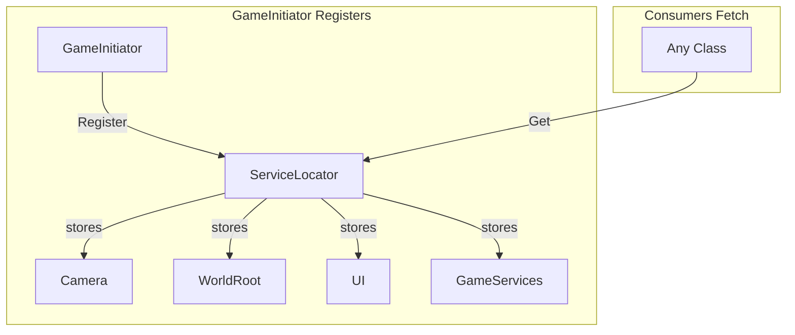
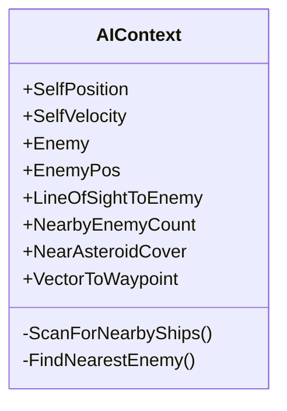
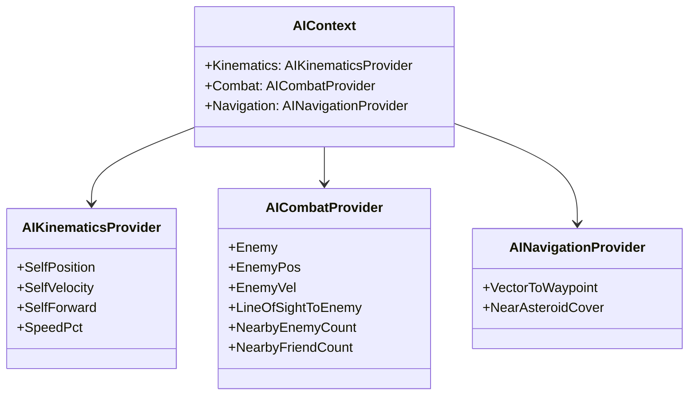

# Asteroids3D Refactoring Plan for Onboarding Engineer

This plan addresses the issues identified in the code review, ordered by priority. Each item includes context to help you understand *why* the change matters and *where* to look.

---

## Phase 1: Critical Bugs (Fix First)

### 1.1 Fix Spawner Serialization Bug

**File:** [`Ships/Spawner.cs`](Ships/Spawner.cs)

**The Problem:** The `Spawner` class uses `[SerializeField]` attributes, but it's a plain C# class, not a `MonoBehaviour` or `ScriptableObject`. Unity's serialization system ignores these attributes on regular classes, so all fields silently use their default values.

```csharp
public class Spawner  // <-- NOT a MonoBehaviour
{
    [Header("Game Flow Settings")]
    [SerializeField] private float restartDelay = 3f;  // NEVER SERIALIZED
    [SerializeField] private bool restartOnPlayerDeath = false;
    [SerializeField] private float enemyRespawnDelay = 3f;
    [SerializeField] private float offscreenDistance = 25f;
}
```

**Why This Matters:** If someone tries to configure respawn timing in the Inspector, nothing will happen. This is a silent bug that causes confusion.

**The Fix:** Create a `SpawnerSettings` ScriptableObject and inject it via constructor:

```csharp
// New file: Ships/SpawnerSettings.cs
[CreateAssetMenu(fileName = "SpawnerSettings", menuName = "Ship/SpawnerSettings")]
public class SpawnerSettings : ScriptableObject
{
    public float restartDelay = 3f;
    public bool restartOnPlayerDeath = false;
    public float enemyRespawnDelay = 3f;
    public float offscreenDistance = 25f;
}

// Updated Spawner.cs
public class Spawner
{
    private readonly SpawnerSettings settings;
    
    public Spawner(SpawnerSettings settings, params Ship[] ships) { ... }
}
```

**Files to Update:**

- Create `Ships/SpawnerSettings.cs`
- Modify `Ships/Spawner.cs` to accept settings via constructor
- Update [`Game/GameInitiatorConfig.cs`](Game/GameInitiatorConfig.cs) to include `SpawnerSettings` reference
- Update [`Game/GameServices.cs`](Game/GameServices.cs) to pass settings to Spawner

---

### 1.2 Fix Double Initialization in Ship

**Files:** [`Ships/Ship.cs`](Ships/Ship.cs), [`Ships/Factory.cs`](Ships/Factory.cs)

**The Problem:** Ships can be initialized two ways, which is confusing and error-prone:

1. Via `Factory.CreateShip()` which calls `ship.Initialize(...)`
2. Via Unity's `Start()` lifecycle which also calls `Initialize(...)`
```csharp
// Ship.cs - Self-initializes
private void Start()
{
    Initialize(settings, teamNumber);  // Called by Unity
}

// Factory.cs - Also initializes
public static Ship CreateShip(...)
{
    var ship = Object.Instantiate(prefab, position, rotation);
    ship.Initialize(shipSettings, team);  // Called by factory
    return ship;
}
```


The `isInitialized` flag prevents double-init, but the design is unclear about which path is canonical.

**The Fix:** Remove `Start()` self-initialization. Factory is the only valid creation path during gameplay. If you need prefab-placed ships in scenes (for testing), use a separate `ShipPlacer` component.

**Changes:**

1. Remove the `Start()` method from `Ship.cs`
2. Add a comment in `Ship.cs` documenting that ships must be created via `Factory.CreateShip()`
3. Ensure all ship creation goes through the factory

---

## Phase 2: Architectural Improvements (High Impact)

### 2.1 Replace Service Locator with Explicit Dependencies

**Files:** [`Game/ServiceLocator.cs`](Game/ServiceLocator.cs), [`Game/GameInitiator.cs`](Game/GameInitiator.cs), [`Game/GameServices.cs`](Game/GameServices.cs), and consumers

**The Problem:** `ServiceLocator` is a global registry that hides dependencies:

```csharp
// Anywhere in code, things magically appear:
var camera = ServiceLocator.Get<Camera>();
var spawner = ServiceLocator.Get<Spawner>();
```

This causes:

- **Hidden dependencies** - You can't tell what a class needs by looking at its constructor
- **Hard to test** - Can't easily mock dependencies in unit tests
- **Runtime errors** - Forgetting to register something crashes at runtime, not compile time

**Current Dependency Graph:**



**The Fix (Incremental Approach):**

Since a full DI framework (Zenject) might be overkill, use **constructor injection** manually:

**Step 1:** Create a `GameContext.Services` property that holds initialized services

```csharp
// GameContext.cs becomes the composition root
public class GameContext : MonoSingleton<GameContext>
{
    public GameServices Services { get; private set; }
    public Camera MainCamera { get; private set; }
    public UI.Overlay UI { get; private set; }
    // ... other services
}
```

**Step 2:** Update classes to receive dependencies via constructor or `Initialize()`:

```csharp
// Before: Hidden dependency
public void SomeMethod()
{
    var camera = ServiceLocator.Get<Camera>();
}

// After: Explicit dependency
public class MyClass
{
    private readonly Camera camera;
    
    public MyClass(Camera camera)
    {
        this.camera = camera;
    }
}
```

**Step 3:** Remove `ServiceLocator.cs` once all usages are migrated

**Files to audit for ServiceLocator usage:**

- `Game/GameInitiator.cs` (registers services)
- `Ships/Spawner.cs` (may use services)
- `EnemyAI/AIContext.cs` (may fetch game state)

---

### 2.2 Replace String-Based State Matching

**File:** [`EnemyAI/States/AIStateMachine.cs`](EnemyAI/States/AIStateMachine.cs)

**The Problem:** State weights are matched by string name, which is fragile:

```csharp
private float ApplyStateWeight(AIState state, float baseUtility)
{
    string stateName = state.GetType().Name;
    return stateName switch
    {
        "IdleState" => baseUtility * stateWeights.idleWeight,
        "PatrolState" => baseUtility * stateWeights.patrolWeight,
        // If you rename AttackState to AggressiveState, this silently breaks
    };
}
```

**The Fix:** Add a virtual property to `AIState` base class:

```csharp
// AIState.cs
public abstract class AIState
{
    public abstract StateType Type { get; }
    // ...
}

public enum StateType
{
    Idle, Patrol, Attack, Evade, Kite, Orbit, JinkEvade
}

// AttackState.cs
public class AttackState : AIState
{
    public override StateType Type => StateType.Attack;
}

// AIStateMachine.cs
private float ApplyStateWeight(AIState state, float baseUtility)
{
    return state.Type switch
    {
        StateType.Idle => baseUtility * stateWeights.idleWeight,
        StateType.Attack => baseUtility * stateWeights.attackWeight,
        // Compile error if you forget a case!
        _ => baseUtility
    };
}
```

**Files to Update:**

- [`EnemyAI/States/AIState.cs`](EnemyAI/States/AIState.cs) - Add enum and abstract property
- All state implementations in `EnemyAI/States/` - Implement `Type` property
- [`EnemyAI/States/AIStateMachine.cs`](EnemyAI/States/AIStateMachine.cs) - Use enum switch

---

## Phase 3: Design Improvements (Medium Priority)

### 3.1 Split AIContext Into Focused Providers

**File:** [`EnemyAI/AIContext.cs`](EnemyAI/AIContext.cs)

**The Problem:** `AIContext` is 370+ lines and provides everything: kinematics, enemy info, threats, navigation, tactical analysis. This violates Single Responsibility Principle.

**Current Structure:**



**The Fix:** Extract into focused classes:



**Implementation Steps:**

1. Create `EnemyAI/Providers/AIKinematicsProvider.cs`
2. Create `EnemyAI/Providers/AICombatProvider.cs`
3. Create `EnemyAI/Providers/AINavigationProvider.cs`
4. Update `AIContext` to compose these providers
5. Update AI states to use `ctx.Combat.Enemy` instead of `ctx.Enemy` (can keep both temporarily for compatibility)

---

### 3.2 Make GameServices Support Multiple Ships

**File:** [`Game/GameServices.cs`](Game/GameServices.cs)

**The Problem:** Hardcoded to exactly 1 player and 1 enemy:

```csharp
public Ship Player { get; }
public Ship Enemy { get; }  // What about 2 enemies? Co-op?
```

**The Fix:** Use collections:

```csharp
public class GameServices
{
    public Ship Player { get; }  // Keep for convenience
    public IReadOnlyList<Ship> Enemies { get; }
    public SubscribedSet<Ship> AllShips { get; }
    
    public void SpawnEnemy(Vector3 position) { ... }
    public void RemoveEnemy(Ship enemy) { ... }
}
```

**Note:** This is lower priority if the game design is strictly 1v1. Discuss with team before implementing.

---

## Phase 4: Code Quality (Lower Priority)

### 4.1 Centralize AI Tuning Constants

**Files:** Various AI state files in `EnemyAI/States/`

**The Problem:** Magic numbers scattered throughout:

```csharp
// AttackState.cs
if (dist > 25f) // OrbitState's maxOrbitRadius is 25f
    score += 0.2f;

// JinkEvadeState.cs  
private const float JinkDistance = 8f;
```

**The Fix:** Create a single tuning ScriptableObject:

```csharp
[CreateAssetMenu(fileName = "AITuning", menuName = "AI/AITuning")]
public class AITuning : ScriptableObject
{
    [Header("Attack")]
    public float AttackFacingDistance = 6f;
    public float AttackOuterBonus = 0.2f;
    
    [Header("Orbit")]
    public float OrbitMaxRadius = 25f;
    
    [Header("Evade")]
    public float JinkDistance = 8f;
}
```

---

### 4.2 Extract Editor Gizmo Code to Partial Classes

**Files:** `DamageController.cs`, `AINavigator.cs`, `AIGunner.cs`, `AIStateMachine.cs`

**The Problem:** Runtime files contain 50-100+ lines of `#if UNITY_EDITOR` gizmo code, making them harder to read.

**The Fix:** Use partial classes:

```csharp
// Ships/Damage/DamageController.cs (runtime)
public partial class DamageController : MonoBehaviour
{
    // Core logic only
}

// Ships/Damage/DamageController.Editor.cs (in Editor folder or same folder)
#if UNITY_EDITOR
public partial class DamageController
{
    private void OnDrawGizmosSelected() { ... }
}
#endif
```

---

### 4.3 Standardize Null Checking

**The Problem:** Mixed styles: `if (x)` vs `if (x != null)` vs `x?.Method()`

**Convention to Adopt:**

- Use `if (component != null)` for explicit Unity object checks
- Use `?.` for optional chaining where appropriate
- Never use `if (component)` for non-MonoBehaviour types

---

## Suggested Order of Execution

| Week | Task | Risk | Effort |

|------|------|------|--------|

| 1 | 1.1 Spawner serialization fix | Low | Small |

| 1 | 1.2 Ship double-init fix | Low | Small |

| 2 | 2.2 String-based state matching | Low | Medium |

| 2-3 | 2.1 ServiceLocator replacement | Medium | Large |

| 3-4 | 3.1 AIContext split | Medium | Medium |

| 4 | 3.2 Multi-ship support | Low | Medium |

| Ongoing | 4.x Code quality items | Low | Small |

---

## Testing Notes

After each change:

1. Play-test basic gameplay (ship movement, shooting, AI behavior)
2. Verify enemy respawns correctly
3. Check AI state transitions in Scene view gizmos
4. Ensure no NullReferenceExceptions in console